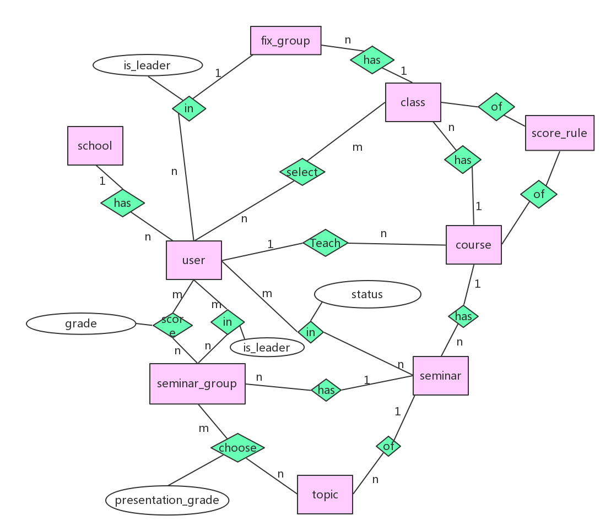

# 结构设计

## 1. 概念结构设计

本数据库设计E-R如下：

其中，主要考虑到教师和学生的类型十分相似，故而采用将两者合并为用户user。

为说明简洁，各实体具体属性及描述将在第2节说明，实体间关系描述将在第3节说明。

## 2. 实体设计

| 实体                | 属性                                                                                                    | 描述                                                                                                                      |
|---------------------|---------------------------------------------------------------------------------------------------------|---------------------------------------------------------------------------------------------------------------------------|
| school              | id name province city                                                                                   | 包含学校基本信息 学校编号 学校名称 所在省 所在市                                                                          |
| user                |  id phone_number wechat_id icon password name school_id is_male is_student number education email      | 包含用户信息（教师、学生） 用户编号 手机号 微信 头像 密码 姓名 学校 性别（男/女） 类型（教师/学生） 教工号/学号 学历 邮箱 |
| course              | id name start_date end_date teacher_id description score_rule_id                                        | 包含课程信息 课程编号 课程名称 开始时间 结束时间 创建教师 课程说明 评分规则                                               |
| score_rule          | id seminar_percentage report_percentage fivePoint_percentage fourPoint_Percentage threePoint_Percentage | 包含评分的规则 评分规则编号 讨论课占比 报告占比 5分占比 4分占比 3分占比                                                   |
| class               | id name course_id site time score_rule_id                                                               | 包含班级信息，具体有： 班级编号 班级名称 课程名称 上课地点 上课时间 评分规则                                              |
| seminar             | id name description course_id is_fixed start_time end_time                                              | 包含讨论课信息，具体有： 讨论课编号 讨论课名称 讨论课说明 所属课程 分组方式（随机分组/固定分组） 开始时间 结束时间        |
| topic               | id name description group_number_limit group_student_limit seminar_id                                   | 包含话题信息，具体有 话题编号 话题名称 话题说明 小组数量上限 组内人数限制 所属讨论课                                      |
| fix_group           | id class_id leader                                                                                  | 包含固定小组信息，具体有 固定小组编号 所属班级 组长编号                                  |
| seminar_group       | id seminar_id report_grade report class_id leader                                                               | 包含讨论课小组信息，具体有 讨论课小组编号 讨论课编号 报告评分 报告文档 班级编号 组长编号                   |
| student_score_group | id student_id seminar_group_topic grade                                                                 | 包含学生给小组打分的信息，具体有 打分编号 学生 讨论课小组 分数                                                            |
| location |  id class_id seminar_id longitude latitude status | 包含教师位置信息，签到时用 位置编号 班级编号 讨论课编号 经度 纬度 当前签到状态，0为签到结束，1为正在签到 | 

## 3. 关系设计

其中，

(1)…(1)表示一对一的关系

(1)…(n)表示一对多的关系

(n)…(m)表示多对多的关系

| 关系                                                 | 描述                                  | 附加属性                                                 |
|------------------------------------------------------|---------------------------------------|----------------------------------------------------------|
| school(1) has user(n)                                | 用户就读/就职的学校                   |                                                          |
| user(1) teach course(n)                              | 教师类型的用户创建课程                |                                                          |
| course(1) has class(n)                               | 课程包含班级                          |                                                          |
| score_rule(1) of course(1) score_rule(1) of class(n) | 课程对应的评分规则 班级对应的评分规则 |                                                          |
| course(1) has seminar(n)                             | 课程包含讨论课                        |                                                          |
| class(1) has fix_group(n)                            | 班级包含固定小组                      |                                                          |
| seminar(1) has seminar_group(n)                      | 讨论课包含讨论课小组                  |                                                          |
| topic(n) of seminar(1)                               | 讨论课包含话题                        |                                                          |
| seminar_group(n) choose topic(m)                     | 讨论课小组选择话题                    | presentation_grade表示参与话题讨论的讨论课小组的讨论成绩 |
| user(n) select class(m)                              | 学生类型的用户选择班级                |                                                          |
| user(n) in seminar(n)                                | 学生类型的用户参与讨论课              | status表示该用户的签到情况                               |
| user(n) in fix_group(n)                              | 固定小组包含学生类型的用户            | is_leader表示该用户是否为组长                            |
| user(n) in seminar_group(m)                          | 讨论课小组包含学生类型的用户          | is_leader表示该用户是否为组长                            |
| user(n) score seminar_group(m)                       | 学生类型的用户给讨论课小组打分        | grade表示用户给讨论课小组的分数                          |